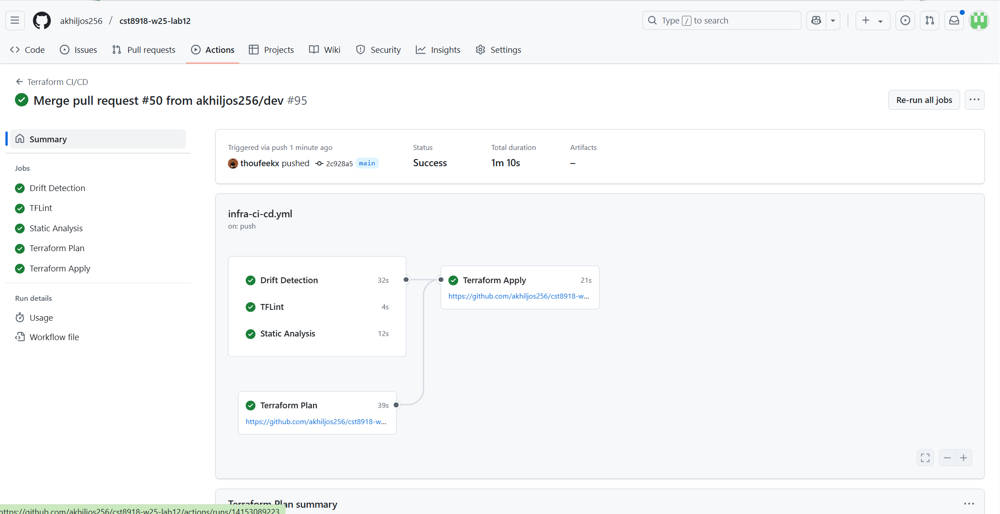
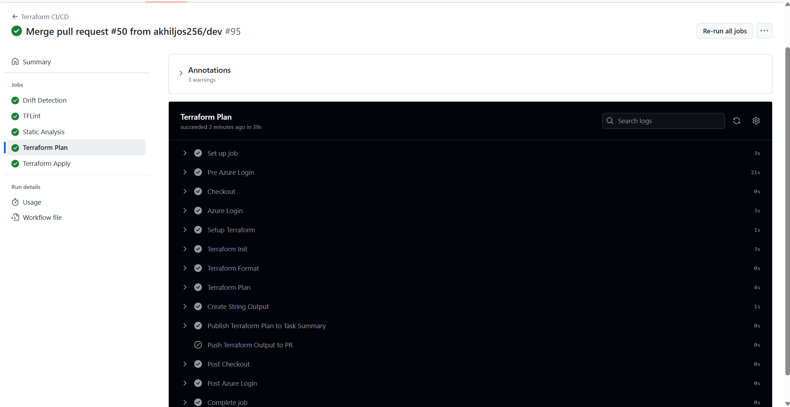

# CST8918 - DevOps: Infrastructure as Code - Lab 12

## Team Members
- Akhil Jose ([@akhiljos256](https://github.com/akhiljos256))
- Thoufeek ([@thoufeekx](https://github.com/thoufeekx))

## Lab 12: Terraform CI/CD on Azure with GitHub Actions

This repository contains our implementation of Lab 12, focusing on setting up Terraform CI/CD pipelines using GitHub Actions for Azure infrastructure deployment.

## Implementation Steps

### 1. Repository Setup
- Created and cloned the repository
- Added `.gitignore` for Terraform files
- Added initial README.md with team information

### 2. Branch Protection Rules
- Protected the `main` branch:
  - No direct pushes
  - No branch deletion
  - Requires at least one approving review

### 3. GitHub Environment Setup
- Created `production` environment
- Added protection rules:
  - Deploy only from main branch
  - Requires approval from both team members
  - Self-review prevented

### 4. Azure Credentials Setup
- Created two Azure AD applications with service principals:
  1. Read-Write Application (040982662-githubactions-rw)
     - Contributor role
     - Used for deployments
  2. Read-Only Application (040982662-githubactions-r)
     - Reader role
     - Used for pre-deployment validation

- Created three federated credentials:
  1. Production deployments (RW app)
  2. Pull request checks (R app)
  3. Main branch checks (R app)

### 5. GitHub Secrets Configuration
Repository Level Secrets:
- `AZURE_TENANT_ID`: Azure AD Tenant ID
- `AZURE_SUBSCRIPTION_ID`: Azure Subscription ID
- `AZURE_CLIENT_ID`: Reader app ID
- `ARM_ACCESS_KEY`: Storage Account access key

Environment Level Secret (production):
- `AZURE_CLIENT_ID`: Contributor app ID

### 6. OIDC Configuration
- Updated `terraform.tf` in infra/tf-app:
  - Set required Terraform version to "~> 1.5"
  - Updated Azure provider version to "~> 3.96.0"
  - Enabled OIDC authentication:
    ```hcl
    backend "azurerm" {
      use_oidc = true
    }

    provider "azurerm" {
      features {}
      use_oidc = true
    }
    ```
# Step 7 verify

## Workflow Results

### ✅ All Checks Passed


### 🔍 Terraform Plan Output


### 🔄 Drift Detection Results
- ✅ No infrastructure drift detected
- 🔒 Infrastructure matches Terraform state
- 🎯 All resources are in sync

## Project Structure

### 📁 Infrastructure Components
```
infra/
├── tf-app/           # Main Terraform configuration
│   ├── main.tf       # Resource definitions
│   ├── variables.tf   # Input variables
│   ├── outputs.tf     # Output values
│   └── terraform.tf   # Provider and backend config
├── tf-backend/       # Backend storage configuration
└── tf-bootstrap/     # Initial setup resources
```

### 🔄 GitHub Actions Workflows

1. **Static Tests (`infra-static-tests.yml`)**
   - Runs on: Push to any branch
   - Checks:
     - Terraform format
     - Terraform validation
     - TFSec security scan

2. **CI/CD Pipeline (`infra-ci-cd.yml`)**
   - Integration Tests (PR to main)
     - TFLint checks
     - Terraform plan
     - Plan posted to PR
   - Deployment (Push to main)
     - Terraform apply
     - Infrastructure updates

3. **Drift Detection (`infra-drift-detection.yml`)**
   - Runs: Daily at midnight
   - Checks for infrastructure drift
   - Reports any state mismatches

## 🛠️ Development Workflow

1. Create feature branch from `dev`
2. Make infrastructure changes
3. Push changes and create PR
4. Wait for workflow checks
5. Get PR review and approval
6. Merge to main for deployment

## 🔐 Security Features

- OIDC authentication with Azure
- Branch protection rules
- Environment protection rules
- Separate service principals for read/write
- TFSec security scanning
- Infrastructure drift detection
